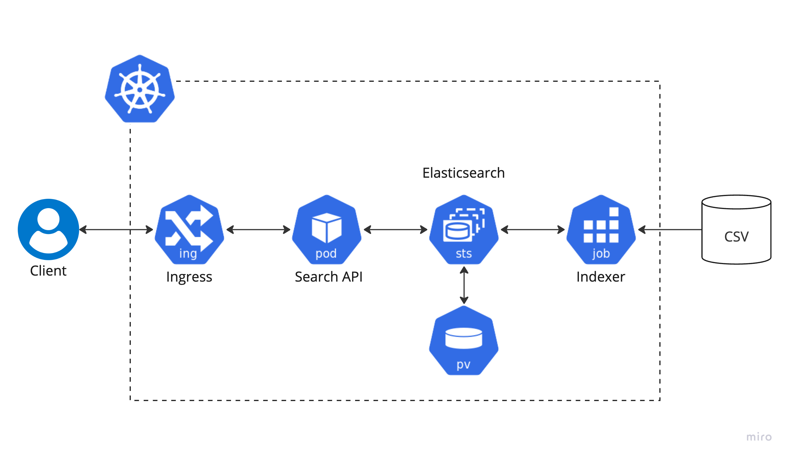

# search-platform-sample

sample search platform by Kotlin,SpringBoot,SolrCloud,AWS EKS

# wip: architecture

| Component  | Technology Selection                | Note                              |
| ---------- | ----------------------------------- | --------------------------------- |
| Search API | Kotlin, SpringBoot, AWS EKS         |                                   |
| Indexer    | Kotlin, SpringBoot, AWS KES, AWS S3 |                                   |
| Solr       | SolrOperator, AWS EKS               | https://solr.apache.org/operator/ |

# sample dataset

https://www.kaggle.com/datasets/jealousleopard/goodreadsbooks
